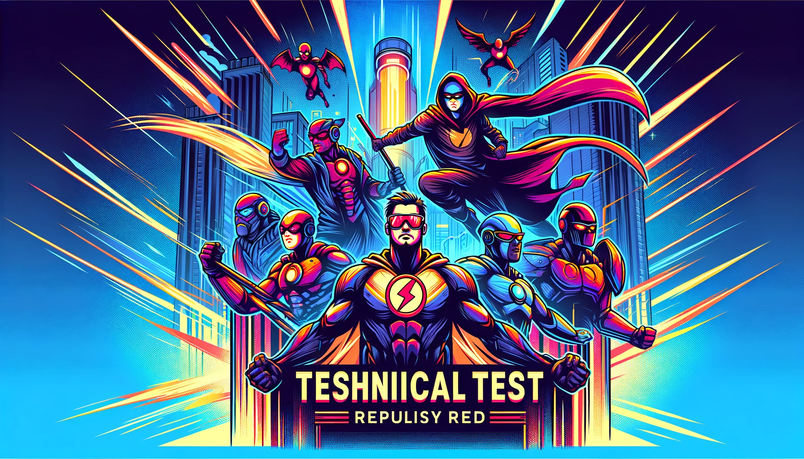

# ⚠️ Important Notice

**The Marvel API is currently experiencing issues, resulting in response times exceeding 1 minute for the past two weeks. For more details, please refer to the [issue tracker](https://www.reddit.com/r/MarvelUnlimited/comments/1eb5ey4/has_anyone_else_noticed_extremely_slow_response/).**

## Marvel SPA

A Marvel SPA (Single Page Application) built with React and Next.js that allows users to search, browse, and favorite Marvel characters. This project demonstrates client-side data fetching, dynamic routing, and server-side rendering with Next.js.

### Features

-   Search Marvel characters by name.
-   Display detailed character information and associated comics.
-   Favorite/unfavorite characters.
-   Store favorite characters in local storage.
-   Dynamic updating of favorite count.

## Getting Started

### Prerequisites

Ensure you have the following installed:

-   Node.js (>= 18.17.x)
-   npm or yarn

### Installation

Clone the repository:

```bash
git clone https://github.com/yourusername/marvel-spa.git
cd marvel-spa
```

## Install dependencies:

```bash
npm install
# or
yarn install
```

## Environment Variables

Create a .env.local file in the root directory and add the following environment variables:

```bash
PUBLIC_KEY=your_public_key
PRIVATE_KEY=your_private_key
MARVEL_HOST=https://gateway.marvel.com/v1/public
```

## Development

To start the development server, run:

```bash
npm run dev
# or
yarn dev
```

Open http://localhost:3000 with your browser to see the result.

## Production

To build the application for production, run:

```bash
npm run build
npm run start
# or
yarn build
yarn start
```

Open http://localhost:3000 with your browser to see the result.

### Context API for Favorites

This project uses React Context API to manage the state of favorite characters globally. The favorite characters are stored in local storage and the count of favorites updates dynamically as users add or remove favorites.

## Components

-   FavoritesButton: Displays the count of favorite characters and navigates to the favorites view.
-   CharacterList: Displays a list of Marvel characters.
-   CharacterDetails: Shows detailed information about a selected character and their associated comics.
-   Search: Provides search functionality to filter characters by name.

## Context Setup

The FavoritesContext provides favorites, addFavorite, removeFavorite, and favoriteCount through a React Context Provider. Wrap your application in FavoritesProvider to make the context available throughout the app.

### Conclusion

This Marvel SPA demonstrates a practical application of React and Next.js, integrating the Marvel API to fetch and display data dynamically while maintaining a responsive and interactive user experience. The use of React Context API ensures state management is seamless and efficient across the application.
